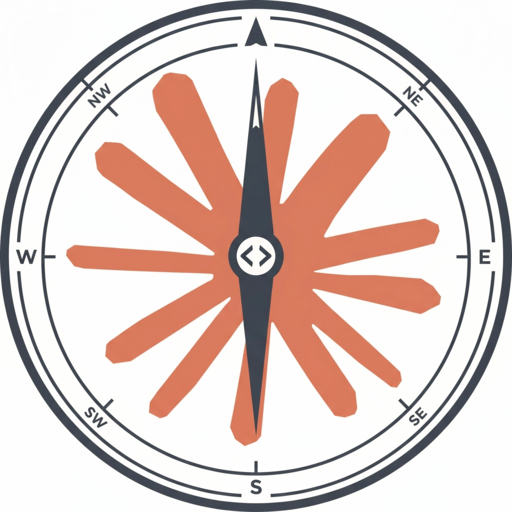

🌐 **Language / 语言:** [English](README.md) | [中文](README.zh-CN.md)

<div align="center">

<picture>
  <source media="(prefers-color-scheme: dark)" srcset="assets/logo/readme-dark.png">
  <source media="(prefers-color-scheme: light)" srcset="assets/logo/readme-light.png">
  
</picture>

**Master Claude Code in a Weekend**

A VitePress-powered multilingual site presenting [luongnv89/claude-howto](https://github.com/luongnv89/claude-howto) content in 5 languages.

[](https://chhsiching.github.io/claude-howto-web/)
[](https://github.com/ChHsiching/claude-howto-web)
[](https://github.com/ChHsiching/claude-howto-web)
[](https://umami.is)

</div>

---

## Features

- **Multilingual**: English, Tiếng Việt, 中文, Українська, 日本語 — using VitePress i18n
- **Dynamic sidebar**: Auto-generated from upstream content structure
- **Automated sync**: Content pulled from upstream via git submodule every 6 hours
- **CI/CD**: GitHub Actions builds and deploys to GitHub Pages
- **Privacy-first analytics**: Self-hosted [Umami](https://umami.is/) — no cookies, no personal data collected

## Quick Start

```bash
# Clone with submodule
git clone --recurse-submodules https://github.com/ChHsiching/claude-howto-web.git
cd claude-howto-web

# Use correct Node version
nvm use

# Install dependencies
npm install

# Run dev server (syncs content first)
npm run docs:dev
```

## Scripts

| Command | Description |
|---------|-------------|
| `npm run sync` | Sync content from upstream submodule |
| `npm run docs:dev` | Sync + start dev server |
| `npm run docs:build` | Sync + build static site |
| `npm run docs:preview` | Preview built site |

## How Content Sync Works

1. `scripts/sync-content.mjs` reads the git submodule at `upstream/`
2. Copies English content to `docs/` (root locale), other languages to `docs/{lang}/`
3. Rewrites relative image paths to absolute for VitePress compatibility
4. Copies shared assets (logos, icons) to each language directory
5. Generates `docs/.vitepress/sidebar.json` from the directory structure

The upstream source files are never modified.

## Updating the Upstream Submodule

```bash
# Pull latest upstream changes
git submodule update --remote upstream

# Commit the update
git add upstream
git commit -m "chore: update upstream submodule"
```

## GitHub Actions Workflows

### Deploy (`deploy.yml`)
- Triggers on push to `main`
- Builds and deploys to GitHub Pages

### Sync (`sync.yml`)
- **Scheduled**: Checks for upstream changes every 6 hours
- **Manual**: Trigger via `workflow_dispatch` from the Actions tab
- **Smart build**: Only builds when upstream has new commits
- Commits synced content to `develop`, then merges to `main` (triggers deploy)

### Stats (`update-stats.yml`)
- **Scheduled**: Updates visitor stats daily at 10:00 and 22:00 (Asia/Shanghai)
- **Privacy**: Only aggregates path-level visit counts from self-hosted Umami
- Does not trigger site redeployment (`[skip ci]`)

## Project Structure

```
├── .github/workflows/
│   ├── deploy.yml                # Deploy to GitHub Pages
│   ├── sync.yml                  # Upstream sync (every 6 hours)
│   └── update-stats.yml          # Visitor stats (twice daily)
├── docs/
│   ├── .vitepress/config.ts      # VitePress config with i18n
│   ├── .vitepress/sidebar.json   # Auto-generated sidebar
│   ├── index.md                  # Homepage
│   ├── 01-slash-commands/ ...    # English content (root locale)
│   ├── vi/                       # Vietnamese
│   ├── zh/                       # Chinese
│   ├── uk/                       # Ukrainian
│   └── ja/                       # Japanese
├── scripts/
│   ├── sync-content.mjs          # Content sync + sidebar generator
│   └── fetch-stats.mjs           # Umami API stats fetcher
├── upstream/                     # git submodule (luongnv89/claude-howto)
└── package.json
```

## License

Content is from [luongnv89/claude-howto](https://github.com/luongnv89/claude-howto) (MIT License).

## Privacy

This site uses [Umami](https://umami.is/) for privacy-friendly analytics. No cookies are used, no personal data is collected, and all data is self-hosted. The tracker respects the Do Not Track browser setting. Fully compliant with GDPR, CCPA, and PECR.
